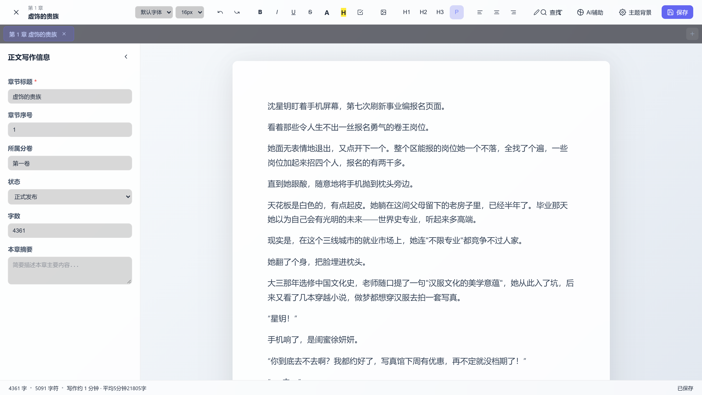
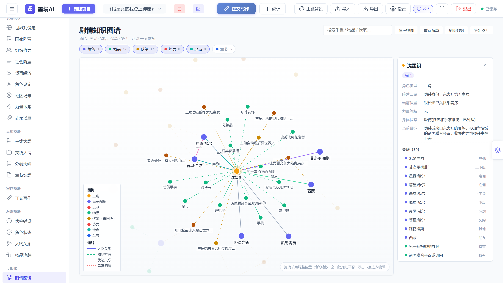
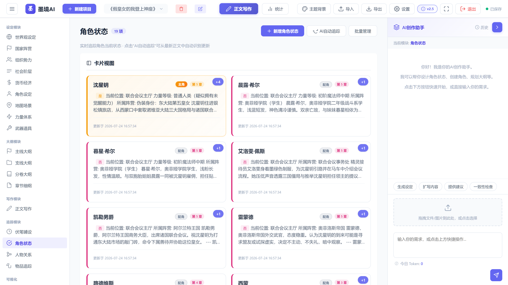
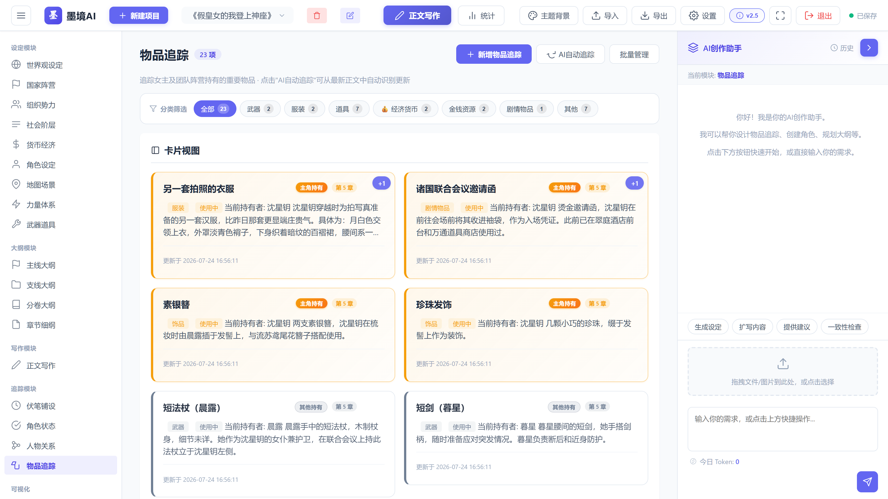

<div align="center">


# 墨境AI · Mojing AI

**沉浸式网文创作辅助系统**
**An Immersive AI-Assisted Writing System for Web-Novel Authors**


[🌐 在线官网 Website](https://senumirai.github.io/mojing-ai/) ·
[⬇️ 下载最新版 Download](https://github.com/SenuMirai/mojing-ai/releases/latest) ·
[📝 更新日志 Changelog](https://senumirai.github.io/mojing-ai/#changelog)

<sub>**简体中文** · [English ↓](#english)</sub>

</div>

---

## 📖 项目简介

**墨境AI** 是一款面向中文网络文学创作者的 **AI 驱动创作辅助系统**。它把大语言模型的生成能力与结构化的设定管理体系深度融合，覆盖从世界观搭建、大纲规划、正文写作到角色状态与伏笔追踪的全流程，并新增 **剧情知识图谱** 将全书的角色、关系、物品、伏笔、势力、地点与章节汇成一张可交互的关系网络。

软件为 **本地运行的单文件程序**：双击 `墨境AI.exe` 后，程序会在本地启动服务并自动打开浏览器界面；所有创作数据保存在本机 SQLite 数据库（`mojing.db`）中，**不上传任何服务器**，并具备自动备份与一键恢复能力。

> 本项目为 **第四届吉林省研究生人工智能创新大赛** 参赛作品。

## ✨ 核心特性

| 模块 | 说明 |
| --- | --- |
| 🕸 **剧情知识图谱** (v2.5) | 自动聚合角色 / 关系 / 物品 / 伏笔 / 势力 / 地点 / 章节，自研力导向布局（Canvas 2D，无外部依赖、完全离线）；支持拖拽缩放、悬停高亮、搜索定位、双击跳转编辑、一键导出 PNG，并给出待回收伏笔、关系最密集角色、孤立角色三项分析 |
| 💾 **数据自动备份与恢复** (v2.4) | 每次启动、每天首次保存前自动快照（SQLite 在线备份 API，WAL 下同样一致）；设置面板内一键备份 / 逐份恢复 / 打开数据目录；自动保留 10 份、手动 20 份；恢复前自动另存当前数据 |
| 🤖 **AI 创作助手** | 接入 DeepSeek、OpenAI、通义千问等 OpenAI 兼容接口，多配置一键切换；命令系统支持全模块 CRUD；Token 用量统计；文件上传读取 |
| ✍️ **沉浸式写作** | 全屏专注编辑器：13 种动态特效、12 种环境录音音效、7 种主题背景、标签式多文档编辑、查找替换（Ctrl+F）、富文本格式、自动保存 |
| 👥 **角色追踪系统** | AI 自动从最新章节增量提取角色状态；主角金色高亮、卡片自动折叠历史版本、时间轴回溯变化历程 |
| 🗡 **物品与伏笔管理** | 物品归属与流转、货币数值精确记录、11 类物品筛选；伏笔铺设与回收进度统计 |
| 🗂 **18 个创作模块** | 设定 9 类 + 大纲 4 类 + 正文写作 + 追踪 4 类，模块间联动更新，全量变更日志可追溯 |
| 🎨 **主题个性化** | 7 种主题风格、自定义图片 / 视频背景（含独立音量）、UI 按钮颜色智能适配、侧栏折叠与全屏模式 |

## 🖼 界面预览

| 沉浸式写作 | 剧情知识图谱 |
| --- | --- |
|  |  |

| 主界面（角色状态） | 物品追踪 |
| --- | --- |
|  |  |

更多界面截图见官网 [界面展示](https://senumirai.github.io/mojing-ai/#showcase) 区块。

## 🚀 快速开始

1. **下载**：前往 [Releases](https://github.com/SenuMirai/mojing-ai/releases/latest) 下载便携版压缩包 `MojingAI_Portable.zip`（约 53 MB）；
2. **解压**：解压到任意目录（路径建议不含特殊字符）；
3. **运行**：双击 `墨境AI.exe` —— 程序自动启动本地服务并打开浏览器（默认 http://localhost:5000）；
4. **配置 AI**：在「设置 → AI 设置」中填入 API 地址、密钥与模型名称（支持 DeepSeek / OpenAI / 通义千问等）；
5. **开始创作**：新建项目，进入任意模块开始写作。

> **环境要求**：Windows 10 / 11（64 位）。程序无需安装 Python，浏览器建议使用 Chrome / Edge 最新版。
> 发行包内同时包含 Python 源码（`app.py`）与依赖清单（`requirements.txt`），可使用 `start_portable.bat` 以源码方式运行（需 Python 3.10+）。
>
> **开箱即用**：发行包已内置演示项目《假皇女的我登上神座》——5 章正文、角色状态 19 条、人物关系 18 条、物品追踪 23 条、伏笔 22 条，打开程序即可直接查看卡片视图、时间轴、统计与剧情知识图谱；演示配置为**空密钥占位**，使用 AI 功能前请在设置中填入自己的 API 密钥；想从零开始时新建项目即可。

## 🔄 版本更新

### v2.5 — 剧情知识图谱（2026-09-26）

- 侧边栏新增「可视化 → 剧情图谱」，把角色、人物关系、物品、伏笔、势力、地点、章节聚合为一张可交互关系网络
- 自研力导向布局（斥力 + 弹簧 + 向心 + 阻尼冷却），纯原生实现、完全离线可用；缩放时节点与文字保持屏幕尺寸恒定
- 拖拽节点、滚轮缩放、空白处平移、悬停/点击高亮关联、搜索定位、双击节点直接跳转编辑、一键导出 PNG
- 图谱分析面板：待回收伏笔清单、关系最多的角色（度数 Top 5）、孤立角色提醒
- 按类型筛选（角色 / 物品 / 伏笔 / 势力 / 地点 / 章节）并配画布图例

### v2.4 — 数据自动备份与恢复（2026-09-26）

- 每次启动、以及每天首次保存前自动备份数据库，自动保留最近 10 份、手动备份 20 份
- 设置弹窗新增「数据备份」标签页：立即备份、恢复最新备份、按时间逐条恢复、一键打开数据目录；恢复前自动把当前数据另存一份
- 修复「退出」按钮与关闭页面后后台服务器未关闭（`/api/shutdown` 异常返回 500）
- 修复沉浸式写作编辑区右侧被裁切、圆角缺失；修复左右侧栏关闭后仍占用布局空间
- 修复超宽图片 / 表格撑出编辑框；AI 助手面板收起按钮改为醒目样式；服务改为多线程，AI 生成期间不再阻塞界面

更早的版本记录（v1.0 → v2.3）见官网 [更新日志](https://senumirai.github.io/mojing-ai/#changelog)。

## 🌐 关于本仓库（官网说明）

本仓库 **`SenuMirai/mojing-ai`** 存放两大内容：

1. **项目官网源码** —— 静态站点，通过 **GitHub Pages** 发布，访问地址：<https://senumirai.github.io/mojing-ai/>
   官网包含「功能特性 / 界面展示 / 更新日志 / 下载 / 联系我们」五大区块，界面截图全部来自程序真实运行画面；下载按钮自动指向本仓库 **Releases 的最新版资产** `MojingAI_Portable.zip`。
2. **发行包（Releases）** —— 每次版本更新后上传最新的便携版压缩包，文件名固定为 `MojingAI_Portable.zip`，保证官网下载链接长期有效。

**官网文件结构**

```
.
├── index.html      # 页面结构（五大区块 + 导航 + 页脚）
├── style.css       # 视觉风格（海盐蓝配色、毛玻璃、响应式布局）
├── script.js       # 粒子背景、滚动揭示、数字递增、卡片 3D 悬停、下载链接解析
├── images/         # 程序真实截图（界面展示区使用）
├── icon-192.png    # 站点图标
└── favicon.ico
```

**本地预览**：克隆仓库后用浏览器直接打开 `index.html` 即可（下载按钮在本地预览时会自动回退到仓库相对路径）。

**自定义**：色板集中在 `style.css` 顶部的 CSS 变量（`--primary` / `--bg` 等）；页面文案与区块内容均在 `index.html` 中。

## 🧱 技术栈

- **后端**：Python 3.10+ · Flask（RESTful API、AI 服务代理、SQLite 在线备份）
- **数据**：SQLite（WAL 模式、`busy_timeout`、本地 `mojing.db`，全量变更日志）
- **前端**：原生 HTML5 / CSS3 / JavaScript 单页应用；Canvas 2D 粒子特效与自研力导向图谱、Web Audio API 音频引擎（无缝循环 + 响度归一化）
- **打包**：PyInstaller 单文件 exe（Windows 免安装，双击即用）
- **官网**：纯静态 HTML / CSS / JS，GitHub Pages 托管

## 👥 团队与联系

**参赛团队：被命运齿轮夹在中间队**（第四届吉林省研究生人工智能创新大赛）

| 成员 | 分工 |
| --- | --- |
| 麦卓颖 | 技术研发负责人 —— 系统架构、前后端开发与 AI 功能设计 |
| 张宇莹 | 宣传推广负责人 —— 视觉设计、文案撰写与视频策划 |

- 项目作者：**千宇·未来**
- 联系邮箱：**qianyuweilai@qq.com**
- 问题反馈：欢迎提交 [Issue](https://github.com/SenuMirai/mojing-ai/issues) 或邮件联系

## 📄 版权说明

© 2026 千宇·未来 · 被命运齿轮夹在中间队 · All Rights Reserved

<br>

---

<a id="english"></a>

<div align="center">

# Mojing AI

**An Immersive AI-Assisted Writing System for Web-Novel Authors**

[🌐 Official Website](https://senumirai.github.io/mojing-ai/) ·
[⬇️ Download Latest](https://github.com/SenuMirai/mojing-ai/releases/latest) ·
[📝 Changelog](https://senumirai.github.io/mojing-ai/#changelog)

</div>

## 📖 Overview

**Mojing AI** is an **AI-powered writing companion for Chinese web-novel (wangwen) authors**. It deeply integrates large-language-model generation with a structured world-building management system, covering the full workflow — from world setting and outline planning to draft writing, character-state tracking and foreshadowing management. Its newest addition, the **Plot Knowledge Graph**, merges every character, relationship, item, foreshadowing thread, faction, location and chapter into one interactive network.

The app is a **single-file, fully local Windows program**: double-click `MojingAI.exe`, the built-in server starts and your browser opens automatically. All creative data stays in a local SQLite database (`mojing.db`) — **nothing is uploaded to any server** — with automatic snapshot backup and one-click restore.

> This project is an entry to the **4th Jilin Province Graduate AI Innovation Competition (第四届吉林省研究生人工智能创新大赛)**.

## ✨ Key Features

- 🕸 **Plot Knowledge Graph (v2.5)** — Aggregates characters, relations, items, foreshadowing, factions, locations and chapters into one interactive graph built on a self-developed force-directed layout (Canvas 2D, zero third-party dependencies, fully offline). Drag / zoom / hover-to-highlight, search & locate, double-click to jump into the editor, one-click PNG export, plus three built-in analyses: unresolved foreshadowing, most-connected characters, and isolated characters.
- 💾 **Automatic Backup & Restore (v2.4)** — A consistent snapshot on every launch and before the first save of each day (SQLite online-backup API, WAL-safe); one-click backup / per-snapshot restore / open-data-folder in the settings panel; 10 automatic + 20 manual snapshots retained, with a safety snapshot taken before any restore.
- 🤖 **AI Writing Assistant** — OpenAI-compatible providers (DeepSeek, OpenAI, Qwen…), multiple switchable configurations, a command system for CRUD across all modules, token-usage stats, and file upload reading.
- ✍️ **Immersive Writing** — Full-screen distraction-free editor with 13 animated ambient effects, 12 recorded environmental soundscapes, 7 themes, tabbed multi-document editing, find & replace (Ctrl+F), rich-text formatting and autosave.
- 👥 **Character Tracking** — AI incrementally extracts character states from the latest chapter; protagonists highlighted in gold, cards collapse version history, timeline view of changes.
- 🗡 **Items & Foreshadowing** — Ownership and transfer tracking, precise currency records, 11 item categories, and planted/resolved foreshadowing statistics.
- 🗂 **18 Writing Modules** — 9 world-setting modules, 4 outline modules, draft writing, and 4 tracking modules — with cross-module context and a full change log.
- 🎨 **Personalization** — 7 theme styles, custom image/video backgrounds (with per-video volume), smart UI accent-color adaptation, collapsible sidebar and full-screen mode.

## 🚀 Quick Start

1. **Download** `MojingAI_Portable.zip` from [Releases](https://github.com/SenuMirai/mojing-ai/releases/latest) (~53 MB);
2. **Unzip** anywhere you like;
3. **Run** — double-click `墨境AI.exe`; the local server starts and your browser opens at http://localhost:5000;
4. **Configure AI** — go to *Settings → AI Settings* and fill in the API endpoint, key and model (DeepSeek / OpenAI / Qwen, etc.);
5. **Start writing** — create a project and dive in.

> **Requirements**: Windows 10 / 11 (64-bit). No Python installation needed. Chrome / Edge recommended. The package also ships the Python source (`app.py`) and `requirements.txt`; run `start_portable.bat` to launch from source (Python 3.10+).
>
> **Demo data included**: the package ships with a sample project (《假皇女的我登上神座》) containing 5 chapters, 19 character states, 18 relations, 23 items and 22 foreshadowing entries — open the app and explore every module (and the Plot Knowledge Graph) right away. The bundled AI config is a placeholder with an empty key, so fill in your own key in Settings before using AI features; create a new project whenever you want to start from scratch.

## 🔄 Release Highlights

**v2.5 — Plot Knowledge Graph (2026-09-26)** · Interactive graph of characters / relations / items / foreshadowing / factions / locations / chapters · self-developed offline force-directed layout · highlight, search, double-click-to-edit, PNG export · graph analysis panel (unresolved foreshadowing, top-connected characters, isolated characters) · type filters and legend.

**v2.4 — Automatic Backup & Restore (2026-09-26)** · Auto snapshots at launch and before the first save each day (10 auto + 20 manual retained, safety snapshot before restore) · new “Data Backup” tab in Settings · fixed the “Exit” button / page-close leaving the server running, the right-side editor clipping and rounded-corner loss, sidebars still occupying layout space when closed, oversized pasted images breaking the editor, and the AI panel collapse button being hard to find · server now multithreaded.

Full history (v1.0 → v2.3) is on the website's [Changelog](https://senumirai.github.io/mojing-ai/#changelog) section.

## 🌐 About This Repository (Website)

This repository hosts:

1. **The project's official website** — a static site published via **GitHub Pages** at <https://senumirai.github.io/mojing-ai/>. Sections: Features · Screenshots · Changelog · Download · Contact. All screenshots are real captures of the running application, and the download button resolves to the **latest release asset** (`MojingAI_Portable.zip`).
2. **Release packages** — every update uploads a new portable ZIP named `MojingAI_Portable.zip`, which keeps the website download link permanently valid.

```
.
├── index.html      # Page structure (5 sections, nav, footer)
├── style.css       # Visual design (sea-salt-blue palette, glassmorphism, responsive)
├── script.js       # Particle canvas, scroll reveal, counters, 3D hover, download resolver
├── images/         # Real application screenshots
└── favicon.ico / icon-192.png
```

**Local preview**: clone the repository and simply open `index.html` — the download button automatically falls back to a local relative path.

## 🧱 Tech Stack

Python 3.10+ · Flask · SQLite (WAL) · vanilla HTML5/CSS3/JS SPA · Canvas 2D effects & custom force-directed graph · Web Audio API · PyInstaller single-file EXE · static site on GitHub Pages.

## 👥 Team & Contact

**Team “被命运齿轮夹在中间队” (Gears of Fate)** — 4th Jilin Province Graduate AI Innovation Competition

- **麦卓颖 (Mai Zhuoying)** — Tech Lead: architecture, full-stack development, AI features
- **张宇莹 (Zhang Yuying)** — Promotion Lead: visual design, documentation, video production

Author: **千宇·未来** · Email: **qianyuweilai@qq.com** · Feel free to open an [Issue](https://github.com/SenuMirai/mojing-ai/issues).

## 📄 License

© 2026 千宇·未来 · 被命运齿轮夹在中间队 · All Rights Reserved